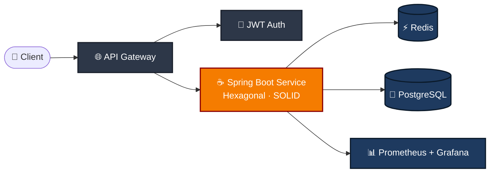

<!-- ╔══════════════════════════════════════════════════════════════════╗ -->
<!--                          HEADER BANNER                              -->
<!-- ╚══════════════════════════════════════════════════════════════════╝ -->

<a href="https://github.com/JuanDulcey">
  
</a>

<!-- Typing animation -->
<p align="center">
  <a href="https://github.com/JuanDulcey">
    
  </a>
</p>

<!-- Stats badges -->
<p align="center">
  
  
  <a href="https://www.linkedin.com/in/juan-esteban-dulcey-8080b91b0">
    
  </a>
</p>

---

## 🧭 About me

Estudiante de **Ingeniería de Sistemas** en la **Universidad Santo Tomás — Seccional Tunja**, enfocado en el **desarrollo backend** con **Java + Spring Boot**. Construyo APIs con **arquitectura hexagonal**, **principios SOLID** y obsesión sana por el **Clean Code**.

Cofundador de **DevV**, creo que la tecnología local puede tener impacto global.

```yaml
location:  Villa de Leyva, Boyacá 🇨🇴
role:      Backend Developer (Java / Spring Boot)
focus:     Clean Architecture · SOLID · Cloud-native APIs
learning:  AWS SAA-C03 · Java 21 LTS · OpenTelemetry · LLM APIs
fun_fact:  Cofounder @ DevV — tech local, impact global
```

---

## 🚀 Currently building

<table>
  <tr>
    <td width="50%" valign="top">
      <h3>🔹 smart-scheduling</h3>
      <p>API REST para gestión de usuarios y agendamiento. <b>Java 17 + Spring Boot</b>, autenticación <b>JWT</b>, arquitectura hexagonal, dockerizado y entregado con CI/CD en GitHub Actions.</p>
      <p>
        
        
        
        
        
      </p>
      <a href="https://github.com/JuanDulcey/smart-scheduling">→ Ver repositorio</a>
    </td>
    <td width="50%" valign="top">
      <h3>🔸 DevV</h3>
      <p>Iniciativa cofundada para impulsar el desarrollo de software desde el contexto colombiano hacia escala global. Stack backend en evolución, enfoque en producto y comunidad.</p>
      <p>
        
        
        
      </p>
    </td>
  </tr>
</table>

---

## 🏗️ Architecture I love to build



---

## 🛠️ Tech stack

**Backend & data**
<p>
  <a href="https://skillicons.dev">
    
  </a>
</p>

**DevOps & cloud**
<p>
  <a href="https://skillicons.dev">
    
  </a>
</p>

**Tooling & frontend basics**
<p>
  <a href="https://skillicons.dev">
    
  </a>
</p>

> 🎯 **Currently leveling up:** Java 21 LTS (virtual threads, pattern matching) · Kubernetes · OpenTelemetry · GraalVM native image · LLM-powered backends (OpenAI / Claude API) · RAG con vector DBs.

---

## 📊 GitHub in numbers

<p align="center">
  
  
  
  
</p>

<p align="center">
  
  
</p>

<p align="center">
  
  
</p>

<p align="center">
  
</p>

---

## 🎓 Education & certifications

🎓 **Universidad Santo Tomás — Seccional Tunja** · Ingeniería de Sistemas  
📍 Villa de Leyva, Boyacá, Colombia

| Certificación | Estado | Emisor |
|---|---|---|
| 🟢 Scrum Fundamentals Certified (SFC™) | Obtenida · May 2025 | SCRUMstudy · ID `1082240` |
| 🟡 AWS Cloud Practitioner (CLF-C02) | En curso | Amazon Web Services |
| 🟡 AWS Solutions Architect Associate (SAA-C03) | En curso | Amazon Web Services |

---

## 📬 Let's connect

<p align="center">
  <a href="https://github.com/JuanDulcey">
    
  </a>
  <a href="https://www.linkedin.com/in/juan-esteban-dulcey-8080b91b0">
    
  </a>
  <a href="mailto:juanesdulcey05@gmail.com">
    
  </a>
</p>

<!-- ╔══════════════════════════════════════════════════════════════════╗ -->
<!--                          FOOTER WAVE                                -->
<!-- ╚══════════════════════════════════════════════════════════════════╝ -->


<p align="center"><sub>© 2026 <b>Juan Esteban Dulcey Gómez</b> · Made with ☕ in Boyacá, Colombia</sub></p>
